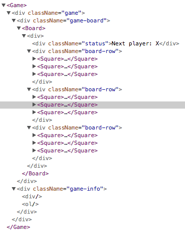

# ReactJs Tac-Tic-Toe小游戏

## 介绍

使用ReactJs构建一个Tac-Tic-Toe小游戏。

## 开始之前

本次内容包含以下4个部分：

- 游戏的配置
- 介绍
- 完成游戏
- 增加时光机

### 我们要建造什么？

开发tic-tac-toe游戏，效果图如下：


### 前提条件

熟悉HTML、JavaScript

熟悉一些概念像：函数、对象、数组、类

JavaScript教程链接： https://developer.mozilla.org/en-US/docs/Web/JavaScript/A_re-introduction_to_JavaScript

## 教程配置

两种方式可以完成该教程

### 教程1配置：在浏览器中写代码

https://codepen.io/gaearon/pen/oWWQNa?editors=0010

### 教程2配置：搭建本地开发环境

#### 配置步骤

1. 安装最新的nodejs 
参考链接： https://www.runoob.com/nodejs/nodejs-install-setup.html
2. 创建项目

```shell
npx create-react-app my-app
```

3. 删除src文件夹中的内容
4. 新建文件index.css，复制内容
5. 新建文件index.js，复制内容
6. 在index.js文件头部新增如下内容

```react
import React from 'react';
import ReactDOM from 'react-dom';
import './index.css';
```

7. 执行启动命令
```shell
npm start
```

## 概览

### 什么是React？

```react
class ShoppingList extends React.Component {
  render() {
    return (
      <div className="shopping-list">
        <h1>Shopping List for {this.props.name}</h1>
        <ul>
          <li>Instagram</li>
          <li>WhatsApp</li>
          <li>Oculus</li>
        </ul>
      </div>
    );
  }
}

// Example usage: <ShoppingList name="Mark" />
```

关键字：

- 组件 Component
- 组件参数 props
- 渲染视图方法 render
- JSX

### 审查开始代码

三个React组件：

- Square
- Board
- Game

> *三个组件在游戏的图中分别代表什么部位？*

### 通过Props传递数据

在Board组件中修改`renderSquare`方法

```react
class Board extends React.Component {
  renderSquare(i) {
    return <Square value={i} />;  }
}
```

在Square组件中修改`render`方法

```react
class Square extends React.Component {
  render() {
    return (
      <button className="square">
        {this.props.value}      </button>
    );
  }
}
```


| 修改前效果                                                   | 修改后效果                                                   |
| ------------------------------------------------------------ | ------------------------------------------------------------ |
|  |  |

### 组件交互

大目标：点击`Square`组件时显示`X`

小目标：点击`Square`组件时弹出提示

修改Square组件如下：

```react
class Square extends React.Component {
 render() {
   return (
     <button className="square" onClick={() => alert('别点我')}>       {this.props.value}
     </button>
   );
 }
}
```

大目标步骤：

- 点击`Square`时填充为`X`
- 并记住点击了哪一个
  - 使用`state`组件存储（记忆）数据

在Square类中增加构造方法（constructor）初始化状态，调整代码如下：

```react
class Square extends React.Component {
  constructor(props) {
    super(props);
    this.state = {
      value: null,
    };
  }

  render() {
    return (
      <button className="square" onClick={() => this.setState({value: 'X'})}>
        {this.state.value}
      </button>
    );
  }
}
```

> 在JavaScript的子类中，必须使用`super(props)`调用父类的构造方法

### 开发者工具



## 完成游戏

目标：

- 交替放置X和O
- 需要一种方法决定胜利者

### 利用状态

- 在Board维护9个方块的值

> *为什么要在Board中维护9个方块的值？*

```react
class Board extends React.Component {
  constructor(props) {
      super(props);    
      this.state = {      
          	squares: Array(9).fill(null),    
          };  
      }
  renderSquare(i) {
    return <Square value={i} />;
  }
```

其中的 `this.state.squares`数据会呈现如下状态：

```javascript
[
  'O', null, 'X',
  'X', 'X', 'O',
  'O', null, null,
]
```

需要考虑两个问题：

- 方块的状态如何传递到Board中？

传值方式如下：

1. 在Square的render方法中使用`this.props.value`替换`this.state.value`
2. 在Square的render方法中使用`this.props.onClick()`替换`this.setState()`
3. 删除Square中的构造器

最终的Square组件代码如下：

```react
class Square extends React.Component {  
    render() {    
        return (
                  <button className="square" onClick={() => this.props.onClick()}>
                    {this.props.value}
                   </button>
                );
  }
}
```

### 为什么不变性是重要的？

### 函数组件

### 实现轮流

### 声明一个胜利者

## 添加时光机

## 保存移动的历史

## 继续利用状态

## 显示过去的移动

## 指定键

## 实现时光机

## 封装